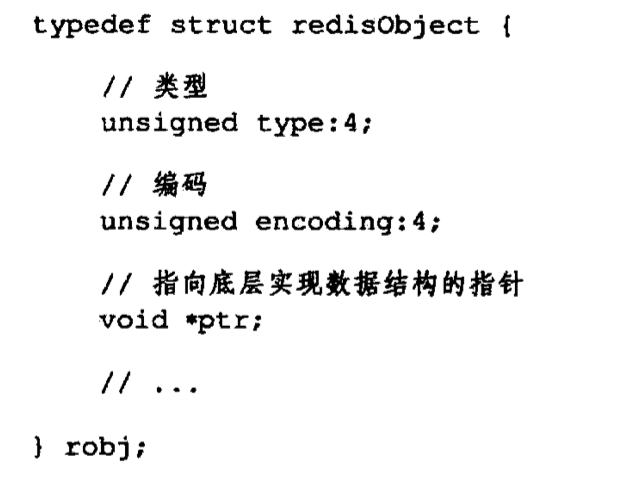
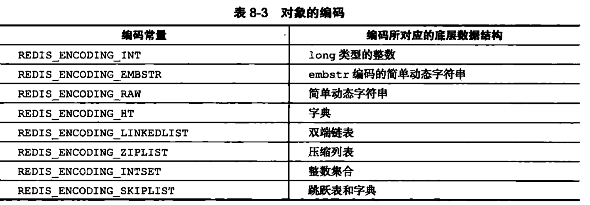
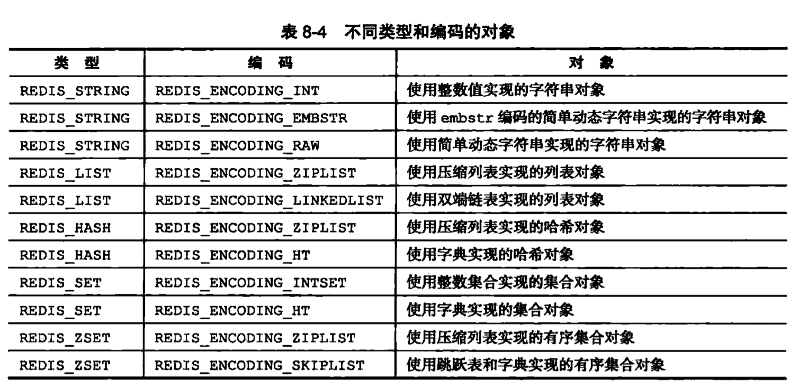

###redis数据结构

#### 1 - 字典（map)

{:height="20%" width="20%"}

渐进式的rehash:不是一次性集中式的rehash，而是一个分多次，渐进式的完成rehash，字典表中维持一个rehashIdx，初始化为0，对每个索引值进行rehash，rehashIdx + 1，直至完成后 rehashidx 设置为-1。

####2- 跳跃表

### 对象

#####1 - 类型

type 类型： type key

encoding 编码和底层实现 : object encoding key

不同类型和编码的对象

##### 2 - 字符串对象

字符串对象的编码可以是int ,raw或者embstr

> 对embStr编码的字符串进行修改时变成raw;对int编码的字符串进行追加操作时变成raw类型
>
> 40字节以上的字符串编码raw
>
> 字符串对象是唯一一中会被其他四中类型对象嵌套的对象

##### 3 - 列表对象

列表对象的编码可以是ziplist或者linkedlist.

编码转换：(可以通过配置修改) list-max-ziplist-value 和 list-max-ziplist-entries两个选项

1. 列表所有字符串长度都小于64字节
2. 列表对象所保存的个数小于512个；不能满足这个条件的列表对象需要使用linkedlist

##### 4 - 哈希对象

编码可以是zipList或者hashtable

编码转换：(可以通过配置修改) hash-max-ziplist-value 和 hash-max-ziplist-entries两个选项

1. 哈希对象所保存的键值对中的键和值的字符串长度都小于64字节

2. 哈希对象所保存的键值对个数小于512个;不能满足这个条件的哈希对象需要使用hashtable

   

##### 5 - 有序集合

编码可以是zipList或者skiplist

