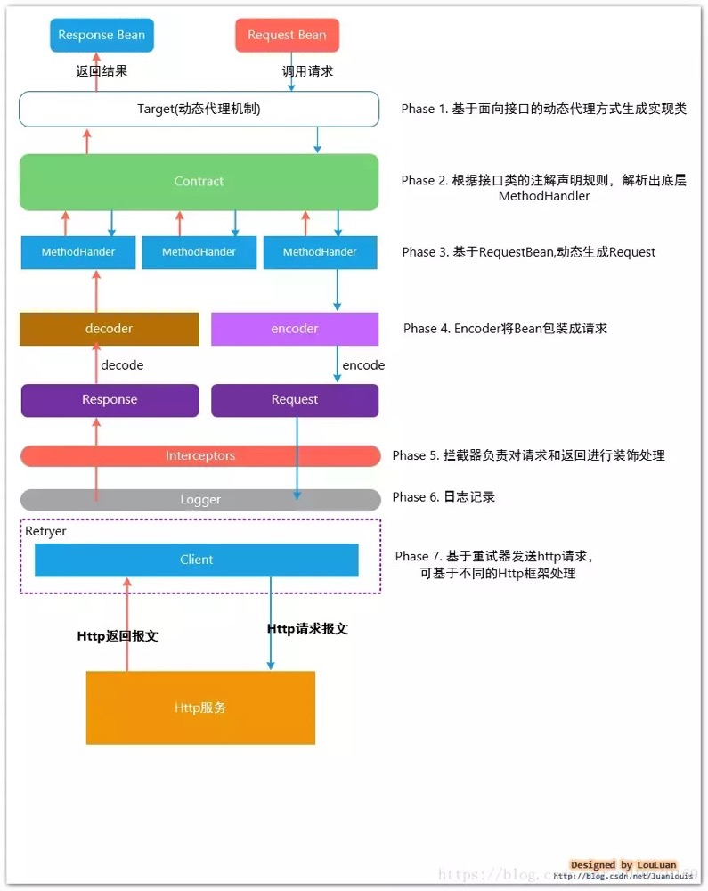

####什么是Feign？[##](https://juejin.im/post/5cc2b7f4e51d456e4869545c)

Feign 的英文表意为“假装，伪装，变形”， 是一个http请求调用的轻量级框架，可以以Java接口注解的方式调用Http请求，而不用像Java中通过封装HTTP请求报文的方式直接调用。Feign通过处理注解，将请求模板化，当实际调用的时候，传入参数，根据参数再应用到请求上，进而转化成真正的请求。

####Feign是如何设计的？



##### 基于面向接口的动态代理方式生成实现类

在使用feign 时，会定义对应的接口类，在接口类上使用Http相关的注解，标识HTTP请求参数信息,如下所示：

```java
interface GitHub {
  @RequestLine("GET /repos/{owner}/{repo}/contributors")
  List<Contributor> contributors(@Param("owner") String owner, @Param("repo") String repo);
}		
```

在Feign 底层，通过基于面向接口的动态代理方式生成实现类，将请求调用委托到动态代理实现类。

#####Feign 真正发送HTTP请求是委托给 feign.Client 来做的

Feign 的性能怎么样？ Feign 整体框架非常小巧，在处理请求转换和消息解析的过程中，基本上没什么时间消耗。真正影响性能的，是处理Http请求的环节。Feign 默认底层通过JDK 的 java.net.HttpURLConnection 实现了feign.Client接口类,在每次发送请求的时候，都会创建新的HttpURLConnection 链接，这也就是为什么默认情况下Feign的性能很差的原因。可以通过拓展该接口，使用Apache HttpClient 或者OkHttp3等基于连接池的高性能Http客户端。

#####retry失败重试，hystrix 熔断支持

https://github.com/OpenFeign/feign