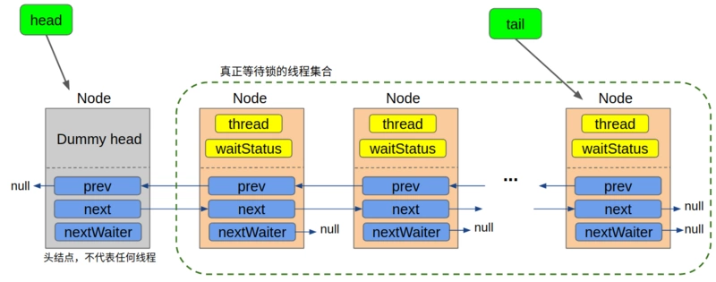
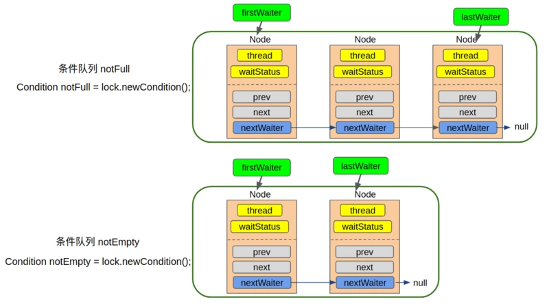
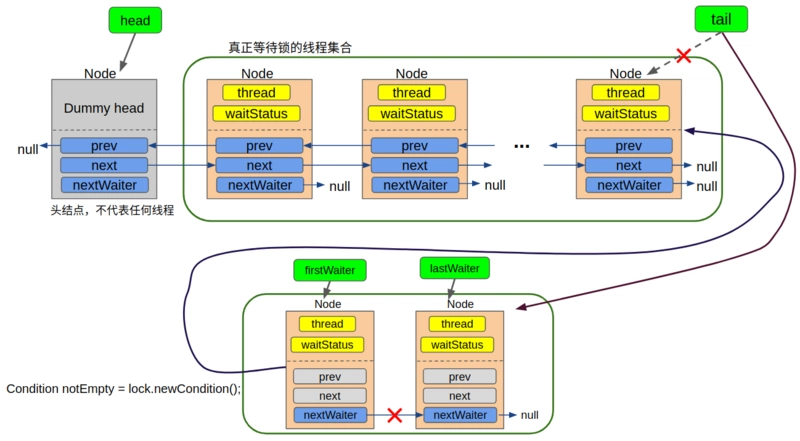

AQS（AbstractQueuedSynchronizer）是JAVA中众多锁以及并发工具的基础，其底层采用乐观锁，大量使用了CAS操作， 并且在冲突时，采用自旋方式重试，以实现轻量级和高效地获取锁。

AQS虽然被定义为抽象类，但事实上它并不包含任何抽象方法。这是因为AQS是被设计来支持多种用途的，如果定义抽象方法，则子类在继承时必须要覆写所有的抽象方法，这显然是不合理的。所以AQS将一些需要子类覆写的方法都设计成protect方法，将其默认实现为抛出`UnsupportedOperationException`异常。如果子类使用到这些方法，但是没有覆写，则会抛出异常；如果子类没有使用到这些方法，则不需要做任何操作。

## AQS核心实现

####  队列sync queue

接着我们来看队列，AQS中，队列的实现是一个双向链表，被称为`sync queue`，它表示**所有等待锁的线程的集合**



#### 独占锁的获取

```java
public final void acquire(int arg) {
    if (!tryAcquire(arg) && acquireQueued(addWaiter(Node.EXCLUSIVE), arg))
        selfInterrupt();
}
```

1. AQS中用state属性表示锁，如果能成功将state属性通过CAS操作从0设置成1即获取了锁
2. 获取了锁的线程才能将exclusiveOwnerThread设置成自己
3. addWaiter负责将当前等待锁的线程包装成Node,并成功地添加到队列的末尾，这一点是由它调用的enq方法保证的，enq方法同时还负责在队列为空时初始化队列。
4. acquireQueued方法用于在Node成功入队后，继续尝试获取锁（取决于Node的前驱节点是不是head），或者将线程挂起
5. shouldParkAfterFailedAcquire方法用于保证当前线程的前驱节点的waitStatus属性值为SIGNAL,从而保证了自己挂起后，前驱节点会负责在合适的时候唤醒自己。
6. parkAndCheckInterrupt方法用于挂起当前线程，并检查中断状态。
7. 如果最终成功获取了锁，线程会从lock()方法返回，继续往下执行；否则，线程会阻塞等待。

#### 独占锁的释放

```java
public final boolean release(int arg) {
    if (tryRelease(arg)) {
        Node h = head;
        if (h != null && h.waitStatus != 0)
            unparkSuccessor(h);
        return true;
    }
    return false;
}
```

在成功释放锁之后(`tryRelease` 返回 `true`之后), 唤醒后继节点只是一个 "附加操作", 无论该操作结果怎样, 最后 `release`操作都会返回 `true`.

```java
private void unparkSuccessor(Node node) {
    int ws = node.waitStatus;
    
    // 如果head节点的ws比0小, 则直接将它设为0
    if (ws < 0)
        compareAndSetWaitStatus(node, ws, 0);

    // 通常情况下, 要唤醒的节点就是自己的后继节点
    // 如果后继节点存在且也在等待锁, 那就直接唤醒它
    // 但是有可能存在 后继节点取消等待锁 的情况
    // 此时从尾节点开始向前找起, 直到找到距离head节点最近的ws<=0的节点
    Node s = node.next;
    if (s == null || s.waitStatus > 0) {
        s = null;
        for (Node t = tail; t != null && t != node; t = t.prev)
            if (t.waitStatus <= 0)
                s = t; // 注意! 这里找到了之并有return, 而是继续向前找
    }
    // 如果找到了还在等待锁的节点,则唤醒它
    if (s != null)
        LockSupport.unpark(s.thread);
}
```

另外一个有趣的问题是, 为什么要从尾节点开始逆向查找, 而不是直接从head节点往后正向查找, 这样只要正向找到第一个, 不就可以停止查找了吗?这个从后往前找的目的其实是为了照顾刚刚加入到队列中的节点，这就牵涉到我们上一篇特别介绍的[“尾分叉”](https://segmentfault.com/a/1190000015739343#articleHeader12)了：

```java
private Node addWaiter(Node mode) {
    Node node = new Node(Thread.currentThread(), mode); //将当前线程包装成Node
    Node pred = tail;
    // 如果队列不为空, 则用CAS方式将当前节点设为尾节点
    if (pred != null) {
        node.prev = pred; //step 1, 设置前驱节点
        if (compareAndSetTail(pred, node)) { // step2, 将当前节点设置成新的尾节点
            pred.next = node; // step 3, 将前驱节点的next属性指向自己
            return node;
        }
    }
    enq(node); 
    return node;
}
```

如果你仔细看上面这段代码, 可以发现**节点入队不是一个原子操作**, 虽然用了`compareAndSetTail`操作保证了当前节点被设置成尾节点，但是只能保证，此时step1和step2是执行完成的，有可能在step3还没有来的及执行到的时候，我们的unparkSuccessor方法就开始执行了，此时pred.next的值还没有被设置成node，所以从前往后遍历的话是遍历不到尾节点的，但是因为尾节点此时已经设置完成，`node.prev = pred`操作也被执行过了，也就是说，如果从后往前遍历的话，新加的尾节点就可以遍历到了，并且可以通过它一直往前找。

所以总结来说，之所以从后往前遍历是因为，我们是处于多线程并发的条件下的，如果一个节点的next属性为null, 并不能保证它就是尾节点（可能是因为新加的尾节点还没来得及执行`pred.next = node`）, 但是一个节点如果能入队, 则它的prev属性一定是有值的,所以反向查找一定是最精确的。

#### Condition queue

每创建一个Condtion对象就会对应一个Condtion队列，每一个调用了Condtion对象的await方法的线程都会被包装成Node扔进一个条件队列中



### sync queue 和 conditon queue的联系

一般情况下，等待锁的`sync queue`和条件队列`condition queue`是相互独立的，彼此之间并没有任何关系。但是，当我们调用某个条件队列的signal方法时，会将某个或所有等待在这个条件队列中的线程唤醒，被唤醒的线程和普通线程一样需要去争锁，如果没有抢到，则同样要被加到等待锁的`sync queue`中去，此时节点就从`condition queue`中被转移到`sync queue`中：



## Condition接口方法实现

### await()第一部分分析

```java
public final void await() throws InterruptedException {
    // 如果当前线程在调动await()方法前已经被中断了，则直接抛出InterruptedException
    if (Thread.interrupted())
        throw new InterruptedException();
    // 将当前线程封装成Node添加到条件队列
    Node node = addConditionWaiter();
    // 释放当前线程所占用的锁，保存当前的锁状态
    int savedState = fullyRelease(node);
    int interruptMode = 0;
    // 如果当前队列不在同步队列中，说明刚刚被await, 还没有人调用signal方法，则直接将当前线程挂起
    while (!isOnSyncQueue(node)) {
        LockSupport.park(this); // 线程将在这里被挂起，停止运行
        // 能执行到这里说明要么是signal方法被调用了，要么是线程被中断了
        // 所以检查下线程被唤醒的原因，如果是因为中断被唤醒，则跳出while循环
        if ((interruptMode = checkInterruptWhileWaiting(node)) != 0)
            break;
    }
    // 第一部分就分析到这里，下面的部分我们到第二部分再看, 先把它注释起来
    /*
    if (acquireQueued(node, savedState) && interruptMode != THROW_IE)
        interruptMode = REINTERRUPT;
    if (node.nextWaiter != null) // clean up if cancelled
        unlinkCancelledWaiters();
    if (interruptMode != 0)
        reportInterruptAfterWait(interruptMode);
    */
}
```

首先是将当前线程封装成Node扔进条件队列中的`addConditionWaiter`方法：

```java
/**
 * Adds a new waiter to wait queue.
 * @return its new wait node
 */
private Node addConditionWaiter() {
    Node t = lastWaiter;
    // 如果尾节点被cancel了，则先遍历整个链表，清除所有被cancel的节点
    if (t != null && t.waitStatus != Node.CONDITION) {
        unlinkCancelledWaiters();
        t = lastWaiter;
    }
    // 将当前线程包装成Node扔进条件队列
    Node node = new Node(Thread.currentThread(), Node.CONDITION);
    /*
    Node(Thread thread, int waitStatus) { // Used by Condition
        this.waitStatus = waitStatus;
        this.thread = thread;
    }
    */
    if (t == null)
        firstWaiter = node;
    else
        t.nextWaiter = node;
    lastWaiter = node;
    return node;
}
```

如果入队时发现尾节点已经取消等待了，那么我们就不应该接在它的后面，此时需要调用`unlinkCancelledWaiters`来剔除那些已经取消等待的线程：该方法将从头节点开始遍历整个队列，剔除其中`waitStatus`不为Node.CONDTION的节点，这里使用了两个指针`firstWaiter`和`trail`来分别记录第一个和最后一个`waitStatus`不为Node.CONDTION的节点.

#### fullyRelease

在节点被成功添加到队列的末尾后，我们将调用fullyRelease来释放当前线程所占用的锁：

```java
final int fullyRelease(Node node) {
    boolean failed = true;
    try {
        int savedState = getState();
        if (release(savedState)) {
            failed = false;
            return savedState;
        } else {
            throw new IllegalMonitorStateException();
        }
    } finally {
        if (failed)
            node.waitStatus = Node.CANCELLED;
    }
}
```

值得注意的是，这是一次性释放了所有的锁，即对于可重入锁而言，无论重入了几次，这里是一次性释放完的，这也就是为什么该方法的名字叫**fully**Release。但这里尤其要注意的是`release(savedState)`方法是有可能抛出IllegalMonitorStateException的，这是因为当前线程可能并不是持有锁的线程。但是咱前面不是说，只有持有锁的线程才能调用await方法吗？既然fullyRelease方法在await方法中，为啥当前线程还有可能并不是持有锁的线程呢？

虽然话是这么说，但是在调用await方法时，我们其实并没有检测`Thread.currentThread() == getExclusiveOwnerThread()`，换句话说，也就是执行到`fullyRelease`这一步，我们才会检测这一点，而这一点检测是由AQS子类实现tryRelease方法来保证的，例如，ReentrantLock对tryRelease方法的实现如下

```java
protected final boolean tryRelease(int releases) {
    int c = getState() - releases;
    if (Thread.currentThread() != getExclusiveOwnerThread())
        throw new IllegalMonitorStateException();
    boolean free = false;
    if (c == 0) {
        free = true;
        setExclusiveOwnerThread(null);
    }
    setState(c);
    return free;
}
```

当发现当前线程不是持有锁的线程时，我们就会进入finally块，将当前Node的状态设为Node.CANCELLED，这也就是为什么上面的`addConditionWaiter`在添加新节点前每次都会检查尾节点是否已经被取消了。

### signalAll()

1. 将条件队列清空（只是令`lastWaiter = firstWaiter = null`，队列中的节点和连接关系仍然还存在）
2. 将条件队列中的头节点取出，使之成为孤立节点(`nextWaiter`,`prev`,`next`属性都为null)
3. 如果该节点处于被Cancelled了的状态，则直接跳过该节点（由于是孤立节点，则会被GC回收）
4. 如果该节点处于正常状态，则通过enq方法将它添加到`sync queue`的末尾
5. 判断是否需要将该节点唤醒(包括设置该节点的前驱节点的状态为SIGNAL)，如有必要，直接唤醒该节点
6. 重复2-5，直到整个条件队列中的节点都被处理完

调用`signal()`方法会从当前条件队列中取出第一个没有被cancel的节点添加到sync队列的末尾。

### await()第二部分分析

前面我们已经分析了signal方法，它会将节点添加进`sync queue`队列中，并要么立即唤醒线程，要么等待前驱节点释放锁后将自己唤醒，无论怎样，被唤醒的线程要从哪里恢复执行呢？当然是被挂起的地方呀，我们在哪里被挂起的呢？还记得吗？当然是调用了await方法的地方，以`await()`方法为例：

```java
public final void await() throws InterruptedException {
    if (Thread.interrupted())
        throw new InterruptedException();
    Node node = addConditionWaiter();
    int savedState = fullyRelease(node);
    int interruptMode = 0;
    while (!isOnSyncQueue(node)) {
        LockSupport.park(this); // 我们在这里被挂起了，被唤醒后，将从这里继续往下运行
        if ((interruptMode = checkInterruptWhileWaiting(node)) != 0)
            break;
    }
    if (acquireQueued(node, savedState) && interruptMode != THROW_IE)
        interruptMode = REINTERRUPT;
    if (node.nextWaiter != null) 
        unlinkCancelledWaiters();
    if (interruptMode != 0)
        reportInterruptAfterWait(interruptMode);
}
```

无论是被中断唤醒还是被signal唤醒，被唤醒的线程最后都将离开`condition queue`，进入到`sync queue`中,随后，线程将在`sync queue`中利用进行`acquireQueued`方法进行“**阻塞式**”争锁，抢到锁就返回，抢不到锁就继续被挂起。因此，当`await()`方法返回时，必然是保证了当前线程已经持有了lock锁。

> 如果从线程被唤醒，到线程获取到锁这段过程中发生过中断，该怎么处理？

我们前面分析[中断](https://segmentfault.com/a/1190000016083002)的时候说过，中断对于当前线程只是个建议，由当前线程决定怎么对其做出处理。在`acquireQueued`方法中，我们对中断是不响应的，只是简单的记录抢锁过程中的中断状态，并在抢到锁后将这个中断状态返回，交于上层调用的函数处理，而这里“上层调用的函数”就是我们的`await()`方法。

那么`await()`方法是怎么对待这个中断的呢？这取决于：

> 中断发生时，线程是否已经被signal过？

我们再来看看`await()`方法是怎么做的，它用中断模式`interruptMode`这个变量记录中断事件，该变量有三个值：

1. `0` ： 代表整个过程中一直没有中断发生。
2. `THROW_IE` ： 表示退出`await()`方法时需要抛出`InterruptedException`，这种模式对应于**中断发生在signal之前**
3. `REINTERRUPT` ： 表示退出`await()`方法时只需要再自我中断以下，这种模式对应于**中断发生在signal之后**，即中断来的太晚了。

```java
/** Mode meaning to reinterrupt on exit from wait */
private static final int REINTERRUPT =  1;
/** Mode meaning to throw InterruptedException on exit from wait */
private static final int THROW_IE    = -1;
```

