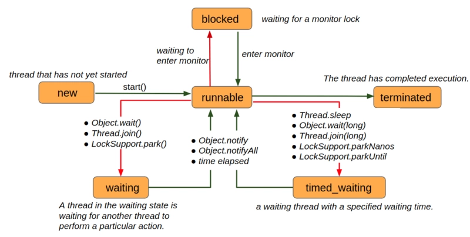

## 线程状态





### 线程方法

#### 	Join

join(0)

```java
public final synchronized void join(long millis) throws InterruptedException {
    ...
    if (millis == 0) {
        while (isAlive()) {
            wait(0);
        }
    } else {
        ...
    }
    ...
}
```

join test demo:

```java
public class JoinMethodTest {

    private static void printWithThread(String content) {
        System.out.println("[" + Thread.currentThread().getName() + "线程]: " + content);
    }

    public static void main(String[] args) {

        printWithThread("开始执行main方法");

        Thread myThread = new Thread(() -> {
            printWithThread("我在自定义的线程的run方法里");
            printWithThread("我马上要休息1秒钟, 并让出CPU给别的线程使用.");
            try {
                Thread.sleep(1000);
                printWithThread("已经休息了1秒, 又重新获得了CPU");
                printWithThread("我休息好了, 马上就退出了");
            } catch (InterruptedException e) {
                e.printStackTrace();
            }

        });
        try {
            myThread.start();
            printWithThread("我在main方法里面, 我要等下面这个线程执行完了才能继续往下执行.");
            myThread.join();
            printWithThread("我在main方法里面, 马上就要退出了.");
        } catch (InterruptedException e) {
            e.printStackTrace();
        }
    }
}
```

1. 首先我们要明确，这里牵涉到两个线程，一个是main线程，一个是我们自定义的myThread线程(即例子里的Thread-0)。

2. 我们在main方法中调用了`myThread.join()`，main方法由main线程执行，所以执行`myThread.join()`这行代码的“当前线程”是main线程。

3. join方法是一个同步方法，使用的是对象锁(this 锁)，即myThread对象所关联的监视器对象。

4. main线程必须首先拿到join方法的监视器锁才能进入同步代码块。

5. main线程进入同步代码块后会首先检查`myThread`线程是否还存活，注意，这里的isAlive是myThread线程的方法，它是检查myThread线程是否还活着，而不是当前线程（当前线程是执行isAlive方法的线程，即main线程）。

6. 如果myThread线程还存活，(main线程)就无限期等待，并让出监视器锁，进入`WAITING`状态。

7. 当main线程从`WAITING`状态被唤醒后（通过notify，notifyAll或者是假唤醒), 将继续竞争监视器锁，当成功获得监视器锁后，他将从调用wait的地方恢复，继续运行。由于wait方法在while循环中，则它将继续检查`myThread`线程是否存活，如果还是没有终止，则继续挂起等待。

8. 可以看出，退出这个“自旋”状态的唯一途径就是`myThread`线程终止运行（或者有中断异常抛出）。

9. 要是没有人调用`notify`或者`notifyAll`,也没有假唤醒状态的发生，那main线程不就一直被`wait(0)`方法挂起了吗？这样以来不就连检测`myThread`线程是否存活的机会都没有吗？这样即使`myThread`终止了，也无法退出啊。

   关于这一点，注释中其实是做了解释的:

   > As a thread terminates the {@code this.notifyAll} method is invoked.

   我们知道，wait(0)方法的监视器锁就是myThread对象(this), 而**当myThread终止执行时，this.notifyAll会被调用**，所以所有等待this锁的线程都会被唤醒，而main线程就是等待在这个监视器锁上的线程，因此myThread运行结束时，main线程会从wait方法处被唤醒。

   #### 线程中断

## Interrupt status & InterruptedException

java中对于中断的大部分操作无外乎以下两点:

1. 设置或者清除中断标志位
2. 抛出`InterruptedException`

在java中，每一个线程都有一个中断标志位，表征了当前线程是否处于被中断状态，我们可以把这个标识位理解成一个boolean类型的变量，当我们中断一个线程时，将该标识位设为true，当我们清除中断状态时，将其设置为false

### interrupt status

```java
/**
 * Tests if some Thread has been interrupted.  The interrupted state
 * is reset or not based on the value of ClearInterrupted that is
 * passed.
 */
private native boolean isInterrupted(boolean ClearInterrupted);

public boolean isInterrupted() {
    return isInterrupted(false);
}

public static boolean interrupted() {
    return currentThread().isInterrupted(true);
}
```

其中`isInterrupted`调用了`isInterrupted(false)`, `ClearInterrupted`参数为`false`, 说明它仅仅返回线程实例的中断状态，但是不会对现有的中断状态做任何改变。

而`interrupted`是一个**静态方法**，所以它可以由Thread类直接调用，自然就是作用于**当前正在执行的线程**，所以函数内部使用了currentThread()方法，与`isInterrupted()`方法不同的是，它的`ClearInterrupted`参数为`true`，在返回线程中断状态的同时，重置了中断标识位。

不过值得一提的是，**在我们能使用到的public方法中，interrupted()是我们清除中断的唯一方法。**

### InterruptedException

```java
/**
 * Thrown when a thread is waiting, sleeping, or otherwise occupied,
 * and the thread is interrupted, either before or during the activity.
 * Occasionally a method may wish to test whether the current
 * thread has been interrupted, and if so, to immediately throw
 * this exception.  The following code can be used to achieve
 * this effect:
 * <pre>
 *  if (Thread.interrupted())  // Clears interrupted status!
 *      throw new InterruptedException();
 * </pre>
 */
public class InterruptedException extends Exception {
```

如果有其他方法直接或间接的调用了这两个方法，那他们自然也会在线程被中断的时候抛出InterruptedException，并且清除中断状态。例如:

- wait()
- wait(long timeout, int nanos)
- sleep(long millis, int nanos)
- join()
- join(long millis)
- join(long millis, int nanos)

## interrupt

**所谓“中断一个线程”，其实并不是让一个线程停止运行，仅仅是将线程的中断标志设为true, 或者在某些特定情况下抛出一个InterruptedException，它并不会直接将一个线程停掉，在被中断的线程的角度看来，仅仅是自己的中断标志位被设为true了，或者自己所执行的代码中抛出了一个InterruptedException异常，仅此而已。**