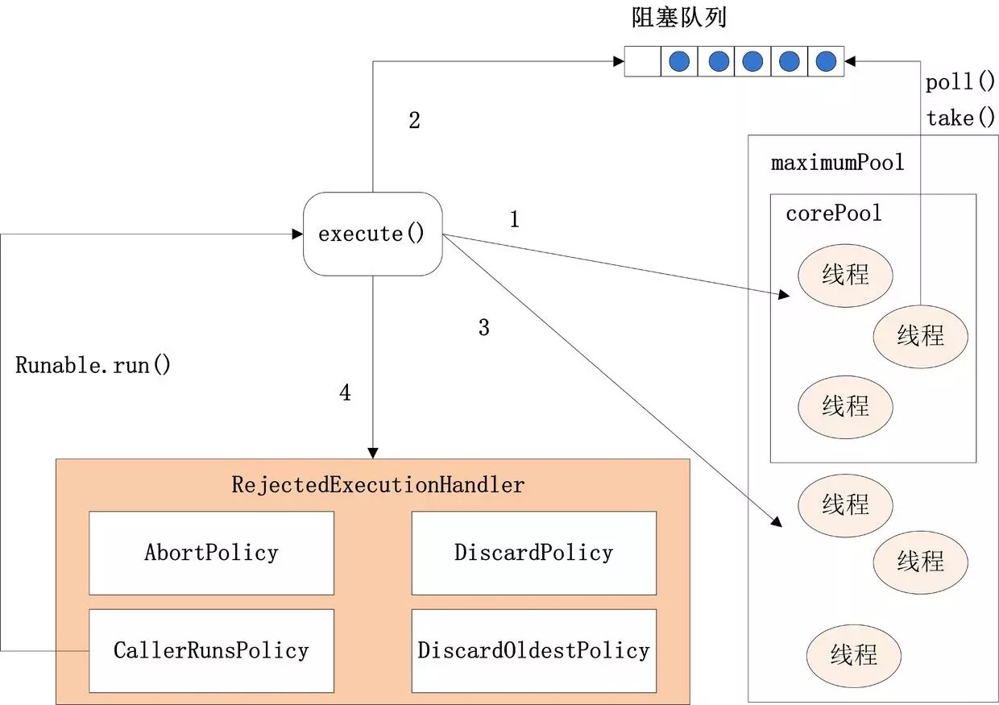

# 线程池ThreadPoolExecutor

#### 线程池的工作原理


#### 线程池的创建

创建线程池主要是**ThreadPoolExecutor**类来完成，ThreadPoolExecutor的有许多重载的构造方法，通过参数最多的构造方法来理解创建线程池有哪些需要配置的参数。ThreadPoolExecutor的构造方法为：

```java
ThreadPoolExecutor(int corePoolSize,
                              int maximumPoolSize,
                              long keepAliveTime,
                              TimeUnit unit,
                              BlockingQueue<Runnable> workQueue,
                              ThreadFactory threadFactory,
                              RejectedExecutionHandler handler)
```

corePoolSize：表示核心线程池的大小。当提交一个任务时，如果当前核心线程池的线程个数没有达到corePoolSize，则会创建新的线程来执行所提交的任务，**即使当前核心线程池有空闲的线程**。如果当前核心线程池的线程个数已经达到了corePoolSize，则不再重新创建线程。如果调用了`prestartCoreThread()`或者 `prestartAllCoreThreads()`，线程池创建的时候所有的核心线程都会被创建并且启动。

maximumPoolSize：表示线程池能创建线程的最大个数。如果当阻塞队列已满时，并且当前线程池线程个数没有超过maximumPoolSize的话，就会创建新的线程来执行任务。

keepAliveTime：空闲线程存活时间。如果当前线程池的线程个数已经超过了corePoolSize，并且线程空闲时间超过了keepAliveTime的话，就会将这些空闲线程销毁，这样可以尽可能降低系统资源消耗。

unit：时间单位。为keepAliveTime指定时间单位。

workQueue：阻塞队列。用于保存任务的阻塞队列，关于阻塞队列[可以看这篇文章](https://juejin.im/post/5aeebd02518825672f19c546)。可以使用**ArrayBlockingQueue, LinkedBlockingQueue, SynchronousQueue, PriorityBlockingQueue**。

threadFactory：创建线程的工程类。可以通过指定线程工厂为每个创建出来的线程设置更有意义的名字，如果出现并发问题，也方便查找问题原因。

handler：饱和策略。当线程池的阻塞队列已满和指定的线程都已经开启，说明当前线程池已经处于饱和状态了，那么就需要采用一种策略来处理这种情况。采用的策略有这几种： 

1. AbortPolicy： 直接拒绝所提交的任务，并抛出**RejectedExecutionException**异常；
2. CallerRunsPolicy：只用调用者所在的线程来执行任务；
3. DiscardPolicy：不处理直接丢弃掉任务；
4. DiscardOldestPolicy：丢弃掉阻塞队列中存放时间最久的任务，执行当前任务



execute方法执行逻辑有这样几种情况：

1. 如果当前运行的线程少于corePoolSize，则会创建新的线程来执行新的任务；
2. 如果运行的线程个数等于或者大于corePoolSize，则会将提交的任务存放到阻塞队列workQueue中；
3. 如果当前workQueue队列已满的话，则会创建新的线程来执行任务；
4. 如果线程个数已经超过了maximumPoolSize，则会使用饱和策略RejectedExecutionHandler来进行处理。

#### 线程池的关闭

关闭线程池，可以通过`shutdown`和`shutdownNow`这两个方法。它们的原理都是遍历线程池中所有的线程，然后依次中断线程。`shutdown`和`shutdownNow`还是有不一样的地方：

1. `shutdownNow`首先将线程池的状态设置为**STOP**,然后尝试**停止所有的正在执行和未执行任务**的线程，并返回等待执行任务的列表；
2. `shutdown`只是将线程池的状态设置为**SHUTDOWN**状态，然后中断所有没有正在执行任务的线程

可以看出shutdown方法会将正在执行的任务继续执行完，而shutdownNow会直接中断正在执行的任务。调用了这两个方法的任意一个，`isShutdown`方法都会返回true，当所有的线程都关闭成功，才表示线程池成功关闭，这时调用`isTerminated`方法才会返回true。


#### 如何合理配置线程池参数？

要想合理的配置线程池，就必须首先分析任务特性，可以从以下几个角度来进行分析：

1. 任务的性质：CPU密集型任务，IO密集型任务和混合型任务。
2. 任务的优先级：高，中和低。
3. 任务的执行时间：长，中和短。
4. 任务的依赖性：是否依赖其他系统资源，如数据库连接。

任务性质不同的任务可以用不同规模的线程池分开处理。CPU密集型任务配置尽可能少的线程数量，如配置**Ncpu+1**个线程的线程池。IO密集型任务则由于需要等待IO操作，线程并不是一直在执行任务，则配置尽可能多的线程，如**2xNcpu**。混合型的任务，如果可以拆分，则将其拆分成一个CPU密集型任务和一个IO密集型任务，只要这两个任务执行的时间相差不是太大，那么分解后执行的吞吐率要高于串行执行的吞吐率，如果这两个任务执行时间相差太大，则没必要进行分解。我们可以通过`Runtime.getRuntime().availableProcessors()`方法获得当前设备的CPU个数。

优先级不同的任务可以使用优先级队列PriorityBlockingQueue来处理。它可以让优先级高的任务先得到执行，需要注意的是如果一直有优先级高的任务提交到队列里，那么优先级低的任务可能永远不能执行。

执行时间不同的任务可以交给不同规模的线程池来处理，或者也可以使用优先级队列，让执行时间短的任务先执行。

依赖数据库连接池的任务，因为线程提交SQL后需要等待数据库返回结果，如果等待的时间越长CPU空闲时间就越长，那么线程数应该设置越大，这样才能更好的利用CPU。

并且，阻塞队列**最好是使用有界队列**，如果采用无界队列的话，一旦任务积压在阻塞队列中的话就会占用过多的内存资源，甚至会使得系统崩溃。