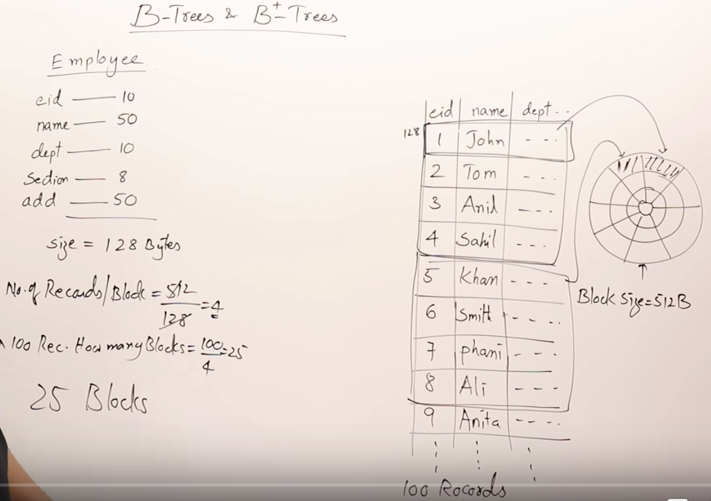
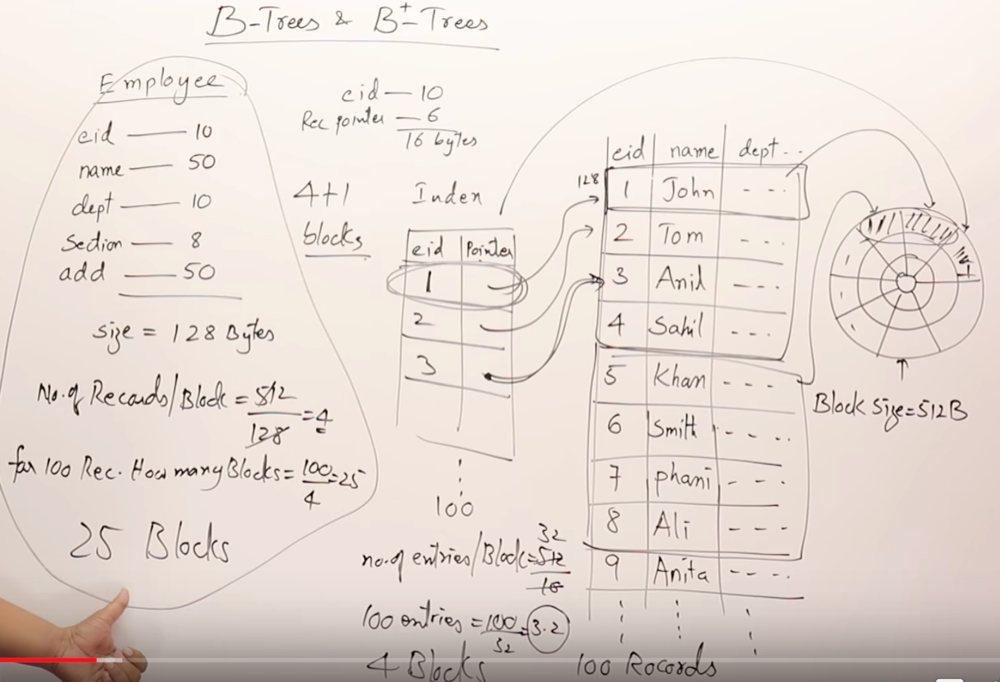
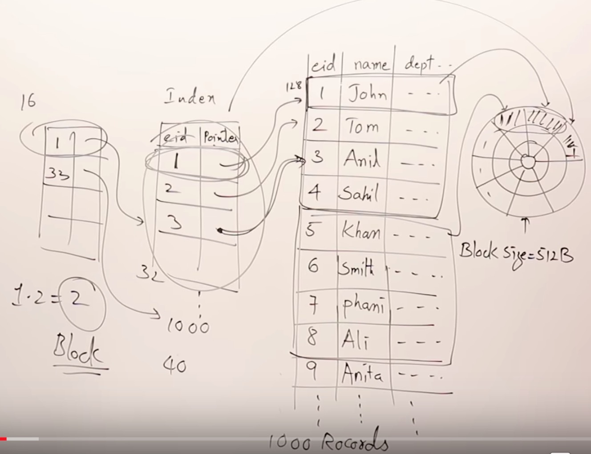
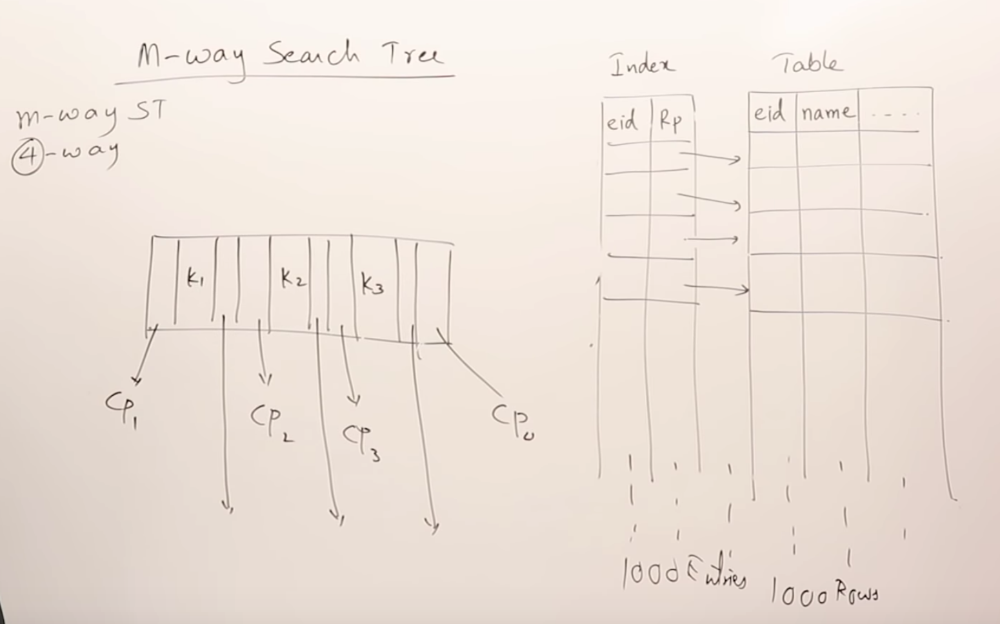
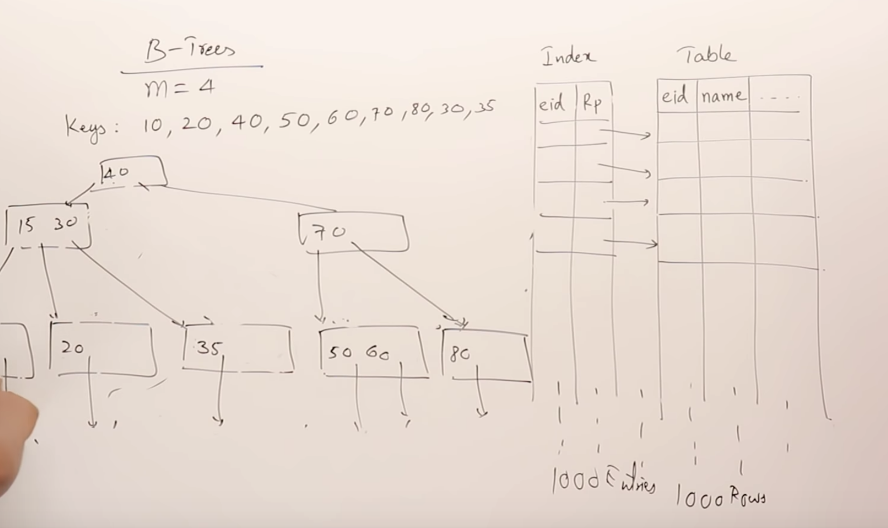
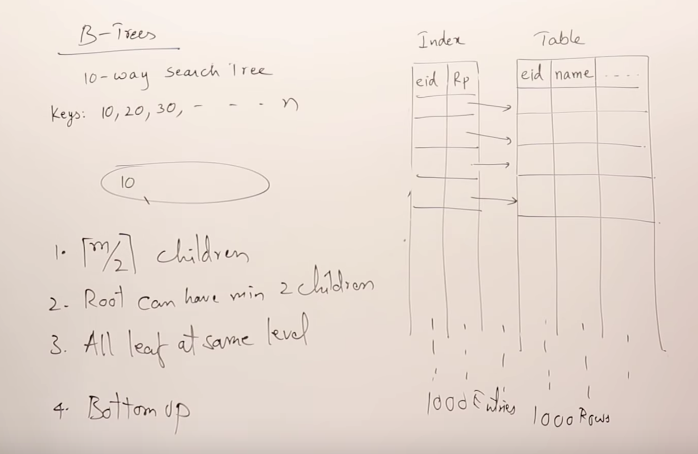
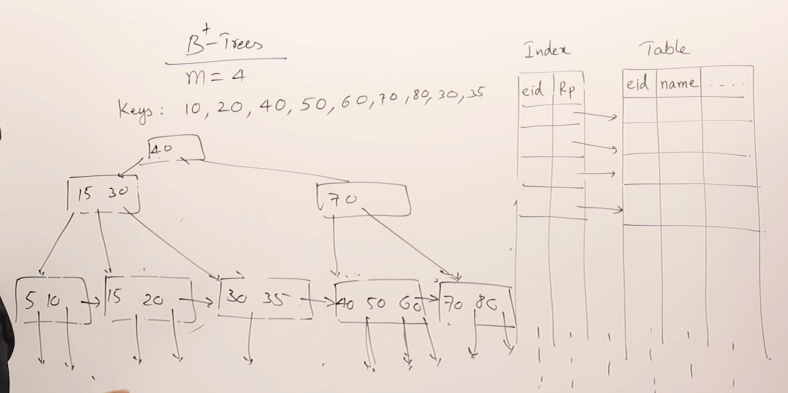

###Btree 索引

####1 ：磁盘结构：磁道，扇区，块

​			 

块中某个位置的地址 = （tracks's addr + Sector‘s addr )  + offset

####2：数据怎么存储在硬盘上

Employee: eid (10), name(50),dept(10),section(8),addr(50) ，存储一条employee记录需要128字节（byte)

假设一个块（block)大小为512byte,故一个块可以存放4条employee记录。

100条记录需要25个块。

如果随机访问某个记录，需要顺序遍历25个块。

#### 3：使用索引加速 访问数据

Index：eid, point(指向eid记录的地址) （6byte），故一条索引需要16字节。

1block存储 512/16 = 32条索引记录。100条员工记录需要的索引得使用 100/32 = 4个 block。

如果随机访问某个employee 记录，可遍历索引，需要4个块，找到对应的块，遍历块中的记录。故需要4+1个块。

#### 4：多级索引

如果employee记录很大，索引也会同步增多。故有了多级索引。

#### 5: m-way search tree

多路搜索树，最多有m个孩子节点，每个节点最多有m-1个key。但是元素插入是没有约束规则。

所以插入时，会形成链式结构，搜索复杂度有o(logn)降低到线性 n。

#### 6 : btree

btree的约束

#### 7：b+tree

