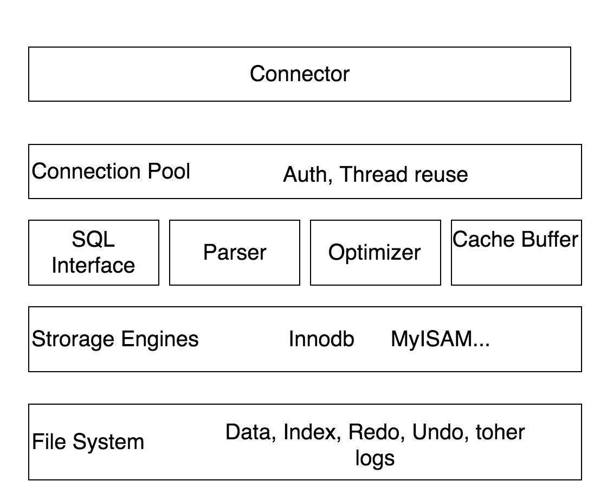
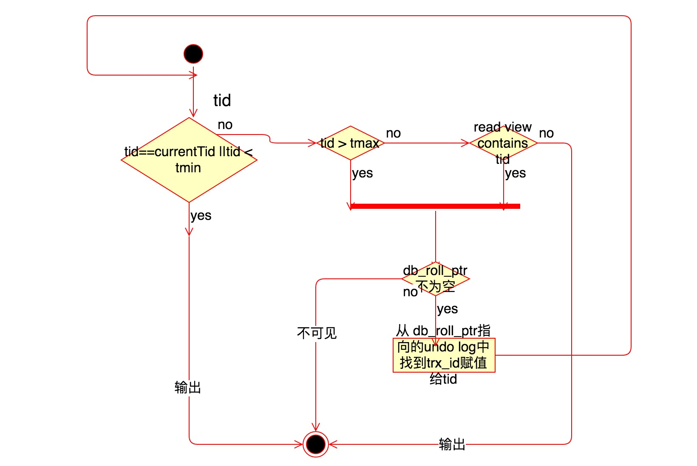

## 大纲

## ###MySQL架构

MySQL从概念上可以分为四层，顶层是接入层，不同语言的客户端通过mysql的协议与mysql服务器进行连接通信，接入层进行权限验证、连接池管理、线程管理等。下面是mysql服务层，包括sql解析器、sql优化器、数据缓冲、缓存等。再下面是mysql中的存储引擎层，mysql中存储引擎是基于表的。最后是系统文件层，保存数据、索引、日志等。



## Redo log, bin log, Undo log

https://liuzhengyang.github.io/2017/04/18/innodb-mvcc/

MySQL Innodb中存在多种日志，除了错误日志、查询日志外，还有很多和数据持久性、一致性有关的日志。
binlog，是mysql服务层产生的日志，常用来进行数据恢复、数据库复制，常见的mysql主从架构，就是采用slave同步master的binlog实现的, 另外通过解析binlog能够实现mysql到其他数据源（如ElasticSearch)的数据复制。
redo log记录了数据操作在物理层面的修改，mysql中使用了大量缓存，缓存存在于内存中，修改操作时会直接修改内存，而不是立刻修改磁盘，当内存和磁盘的数据不一致时，称内存中的数据为脏页(dirty page)。为了保证数据的安全性，事务进行中时会不断的产生redo log，在事务提交时进行一次flush操作，保存到磁盘中, redo log是按照顺序写入的，磁盘的顺序读写的速度远大于随机读写。当数据库或主机失效重启时，会根据redo log进行数据的恢复，如果redo log中有事务提交，则进行事务提交修改数据。这样实现了**事务的原子性、一致性和持久性**。

Undo Log: 除了记录redo log外，当进行数据修改时还会记录undo log，undo log用于数据的撤回操作，它记录了修改的反向操作，比如，插入对应删除，修改对应修改为原来的数据，通过undo log可以实现事务回滚，并且可以根据undo log回溯到某个特定的版本的数据，实现MVCC。

redo log 和binlog的一致性，为了防止写完binlog但是redo log的事务还没提交导致的不一致，innodb 使用了两阶段提交
大致执行序列为

```mysql
InnoDB prepare  （持有prepare_commit_mutex）；
 write/sync Binlog；
 InnoDB commit (写入COMMIT标记后释放prepare_commit_mutex)。
```

## MVCC

MVCC是Multi Version Concurrency Control的简称，代表多版本并发控制。

和Java中的多线程问题相同，数据库通常使用锁来实现隔离性。
最原生的锁，锁住一个资源后会禁止其他任何线程访问同一个资源。但是很多应用的一个特点都是读多写少的场景，很多数据的读取次数远大于修改的次数，而读取数据间互相排斥显得不是很必要。所以就使用了一种读写锁的方法，读锁和读锁之间不互斥，而写锁和写锁、读锁都互斥。这样就很大提升了系统的并发能力。之后人们发现并发读还是不够，又提出了能不能让读写之间也不冲突的方法，就是读取数据时通过一种类似快照的方式将数据保存下来，这样读锁就和写锁不冲突了，不同的事务session会看到自己特定版本的数据。当然快照是一种概念模型，不同的数据库可能用不同的方式来实现这种功能。

## MVCC实现



RR级别下一个事务开始后第一个snapshot read的时候，会将当期活动的事务id记录下来，记录到read view中。

RC级别则是每次snapshot read都会创建一个新的read view。

假设当前,read view中最大的事务id为tmax, 最小为tmin。则判断一个数据是否可见以及对应的版本的方法为。
如果该行中的trx_id, 赋值给tid, 如果tid和当前事务id相等或小于tmin，说明是事务内发生的或开启前的修改，则直接返回该版本数据; 

如果trx_id大于tmax, 则查看该版本的db_roll_ptr中的trx_id，赋值给tid并从头开始判断。如果tid小于tmax并且不在read view中，则返回，否则中回滚段中找出undo log的trx_id，赋值给tid从头判断。

所以可见性是，只有当第一次读之前提交的修改和自己的修改可见，其他的均不可见。