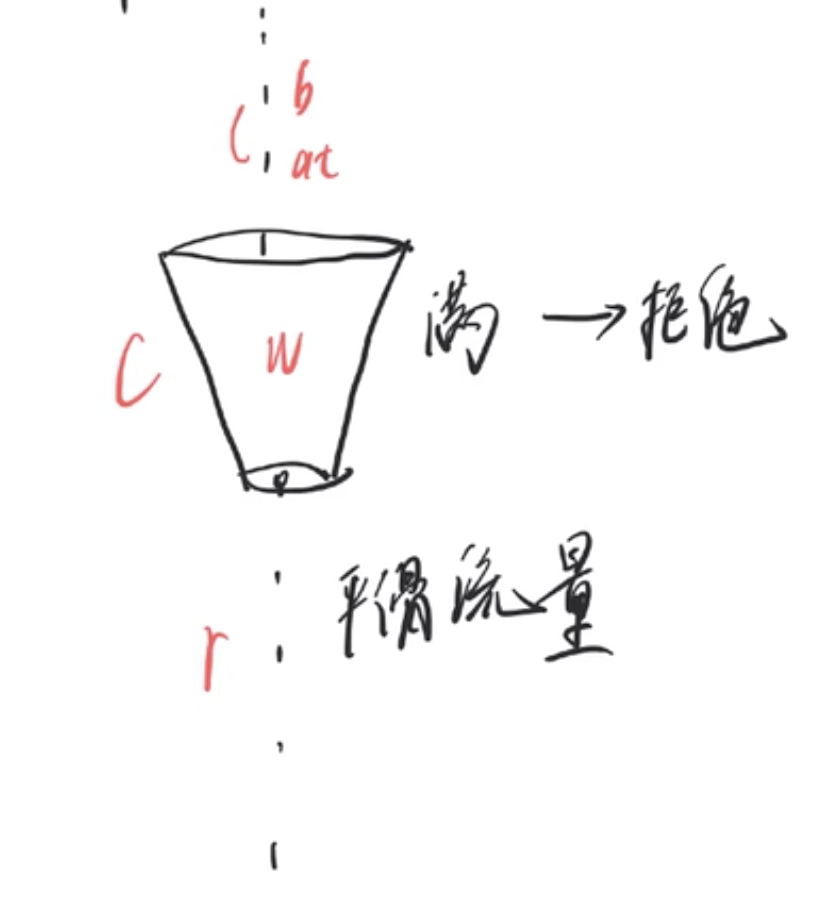

### 限流算法的两种实现：漏桶算法和令牌算法

#### 漏桶算法

特点是流出流量固定。



总容量c，上一个请求的时间是at,桶中水量为w,水流流出的速率是r。当前请求b进来时：

```java
when(b)
	bt = now;
	wb = (bt - at) * r; // b进来时候，水流流出总量
	w = max((wb - w ), 0);
	if(w < c){
    w ++;
    return true; //可以进来
  }else{
    return false; // 当前水桶已满，不能进来
  }
```

#### 令牌桶算法

可以应对突发流量。


总容量c，上一个请求的时间是at,桶中令牌数为w,令牌放入的速率是r。当前请求b进来时：

```java
when(b)
  bt = now;
	wb = (bt - at) * r; //b进来时，可以放入的令牌数
	w = min(wb + w, c); //当前桶中的令牌数量
	if(w > 0){
    w -- ;
    return true;
  }else{
    return false;
  }
```

