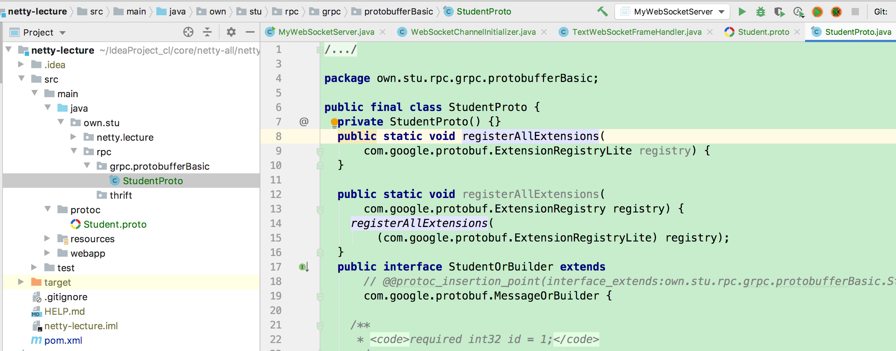

###protoBuffer 

*Protocol buffers* are a language-neutral, platform-neutral extensible mechanism for serializing structured data.

#### HelloWorld demo

1:定义一个.proto文件。该文件类似接口定义语言（idl)

```protobuf
syntax = "proto2";

// you should still define a normal package
// as well to avoid name collisions in the Protocol Buffers name space as well as in non-Java languages.
package own.stu.rpc.grpc.protobufferBasic;

// java_package and java_outer_classname. java_package specifies in
// what Java package name your generated classes should live.
option java_package = "own.stu.rpc.grpc.protobufferBasic";
option java_outer_classname = "StudentProto";

message Student {
  required int32 id = 1;
  optional string name = 2;
  optional string address = 3;
}
```

2:protoc 编译器编译 .proto文件，生成相应语言的数据文件。

protoc --java_out=src/main/java src/main/protoc/Student.proto

tip: .proto文件不应修改任何内容。



3:demo

```java
public class ProtoBufferHelloWorld {

  public static void main(String[] args) throws InvalidProtocolBufferException {
    Student student = Student
        .newBuilder()
        .setId(1).setName("qin").setAddress("上海")
        .build();

    byte[] bytes = student.toByteArray();

    Student student1 = Student.parseFrom(bytes);
    System.out.println(student1);
    System.out.println(student1.getAddress());
  }
}
```