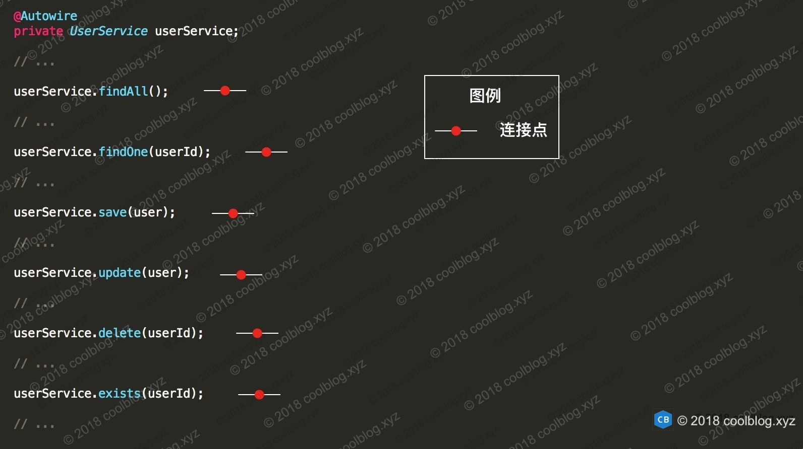
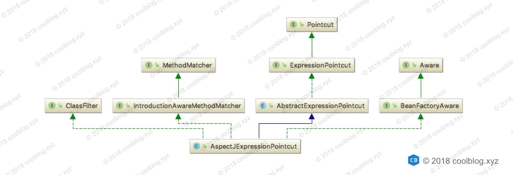
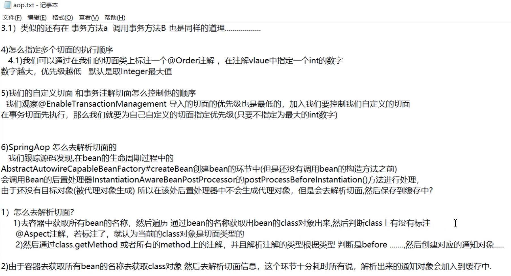

### Spring AOP 源码分析

#### AOP 原理

关于 AOP 的原理，通过代理模式为目标对象生产代理对象，并将横切逻辑插入到目标方法执行的前后。

#### 1:AOP 术语及相应的实现

#####A:连接点 - Joinpoint

连接点是指程序执行过程中的一些点，比如方法调用，异常处理等。在 Spring AOP 中，仅支持方法级别的连接点。

下面举个例子说明一下。现在我们有一个用户服务 UserService 接口

```java
public interface UserService {
    void save(User user);
    void update(User user);
    void delete(String userId);
    User findOne(String userId);
    List<User> findAll();
    boolean exists(String userId);
}
```

假设该类的方法调用如下：



如上所示，每个方法调用都是一个连接点。Joinpoint 接口的一个实现类 ReflectiveMethodInvocation。

```
public interface Joinpoint {

    /** 用于执行拦截器链中的下一个拦截器逻辑 */
    Object proceed() throws Throwable;

    Object getThis();

    AccessibleObject getStaticPart();

}
```


接下来要做的事情是对我们感兴趣连接点进行一些横切操作。在操作之前，我们首先要把我们所感兴趣的连接点选中，怎么选中的呢？这就是切点 Pointcut 要做的事情了。

#####切点 - Pointcut

```java
public interface Pointcut {
    /** 返回一个类型过滤器 */
    ClassFilter getClassFilter();
    /** 返回一个方法匹配器 */
    MethodMatcher getMethodMatcher();
    Pointcut TRUE = TruePointcut.INSTANCE;
}
```

Spring 中提供了一个 AspectJ 表达式切点类 - AspectJExpressionPointcut



这个类最终实现了 Pointcut、ClassFilter 和 MethodMatcher 接口，因此该类具备了通过 AspectJ 表达式对连接点进行选择的能力。那下面我们不妨写一个表达式对上一节的连接点进行选择，比如下面这个表达式：

```java
execution(* *.find*(..))
```

该表达式用于选择以 find 的开头的方法，选择结果如下：


##### C:通知 - Advice

通知 Advice 即我们定义的横切逻辑，比如我们可以定义一个用于监控方法性能的通知，也可以定义一个安全检查的通知等。如果说切点解决了通知在哪里调用的问题，那么现在还需要考虑了一个问题，即通知在何时被调用？是在目标方法前被调用，还是在目标方法返回后被调用，还在两者兼备呢？Spring 帮我们解答了这个问题，Spring 中定义了以下几种通知类型：

- 前置通知（Before advice）- 在目标方便调用前执行通知
- 后置通知（After advice）- 在目标方法完成后执行通知
- 返回通知（After returning advice）- 在目标方法执行成功后，调用通知
- 异常通知（After throwing advice）- 在目标方法抛出异常后，执行通知
- 环绕通知（Around advice）- 在目标方法调用前后均可执行自定义逻辑

现在我们有了切点 Pointcut 和通知 Advice，由于这两个模块目前还是分离的，我们需要把它们整合在一起。这样切点就可以为通知进行导航，然后由通知逻辑实施精确打击。那怎么整合两个模块呢？答案是，`切面`。好的，是时候来介绍切面 Aspect 这个概念了。


##### D:切面 - Aspect

切面 Aspect 整合了切点和通知两个模块，切点解决了 where 问题，通知解决了 when 和 how 问题。切面把两者整合起来，就可以解决 对什么方法（where）在何时（when - 前置还是后置，或者环绕）执行什么样的横切逻辑（how）的三连发问题。在 AOP 中，切面只是一个概念，并没有一个具体的接口或类与此对应。不过 Spring 中倒是有一个接口的用途和切面很像，我们不妨了解一下，这个接口就是切点通知器 PointcutAdvisor。

```java
public interface Advisor {

    Advice getAdvice();
    boolean isPerInstance();
}

public interface PointcutAdvisor extends Advisor {

    Pointcut getPointcut();
}
```

##### E:织入 - Weaving

**所谓织入就是在切点的引导下，将通知逻辑插入到方法调用上，使得我们的通知逻辑在方法调用时得以执行**。说完织入的概念，现在来说说 Spring 是通过何种方式将通知织入到目标方法上的。**先来说说以何种方式进行织入**，这个方式就是通过实现后置处理器 BeanPostProcessor 接口。该接口是 Spring 提供的一个拓展接口，通过实现该接口，用户可在 bean 初始化前后做一些自定义操作。**那 Spring 是在何时进行织入操作的呢？**答案是在 bean 初始化完成后，即 bean 执行完初始化方法（init-method）。Spring通过切点对 bean 类中的方法进行匹配。若匹配成功，则会为该 bean 生成代理对象，并将代理对象返回给容器。容器向后置处理器输入 bean 对象，得到 bean 对象的代理，这样就完成了织入过程。

#### 2:AOP 入口分析

```java
@EnableAspectJAutoProxy //开启aop 功能
@ComponentScan("own.spring.core.part.aop")
public class BeanConfig {
}
@Target(ElementType.TYPE)
@Retention(RetentionPolicy.RUNTIME)
@Documented
@Import(AspectJAutoProxyRegistrar.class)
public @interface EnableAspectJAutoProxy {
}
...
  return registerOrEscalateApcAsRequired(AnnotationAwareAspectJAutoProxyCreator.class, registry, source);
...
  public abstract class AbstractAutoProxyCreator extends ProxyProcessorSupport
        implements SmartInstantiationAwareBeanPostProcessor, BeanFactoryAware {
    
    @Override
    /** bean 初始化后置处理方法 */
    public Object postProcessAfterInitialization(Object bean, String beanName) throws BeansException {
        if (bean != null) {
            Object cacheKey = getCacheKey(bean.getClass(), beanName);
            if (!this.earlyProxyReferences.contains(cacheKey)) {
                // 如果需要，为 bean 生成代理对象
                return wrapIfNecessary(bean, beanName, cacheKey);
            }
        }
        return bean;
    }
}
```

里边会将切面中的advice 封装成Advisor 。

```java
public abstract class AbstractAutoProxyCreator extends ProxyProcessorSupport
        implements SmartInstantiationAwareBeanPostProcessor, BeanFactoryAware {
    
    @Override
    /** bean 初始化后置处理方法 */
    public Object postProcessAfterInitialization(Object bean, String beanName) throws BeansException {
        if (bean != null) {
            Object cacheKey = getCacheKey(bean.getClass(), beanName);
            if (!this.earlyProxyReferences.contains(cacheKey)) {
                // 如果需要，为 bean 生成代理对象
                return wrapIfNecessary(bean, beanName, cacheKey);
            }
        }
        return bean;
    }
    
    protected Object wrapIfNecessary(Object bean, String beanName, Object cacheKey) {
        if (beanName != null && this.targetSourcedBeans.contains(beanName)) {
            return bean;
        }
        if (Boolean.FALSE.equals(this.advisedBeans.get(cacheKey))) {
            return bean;
        }

        /*
         * 如果是基础设施类（Pointcut、Advice、Advisor 等接口的实现类），或是应该跳过的类，
         * 则不应该生成代理，此时直接返回 bean
         */ 
        if (isInfrastructureClass(bean.getClass()) || shouldSkip(bean.getClass(), beanName)) {
            // 将 <cacheKey, FALSE> 键值对放入缓存中，供上面的 if 分支使用
            this.advisedBeans.put(cacheKey, Boolean.FALSE);
            return bean;
        }

        // 为目标 bean 查找合适的通知器
        Object[] specificInterceptors = getAdvicesAndAdvisorsForBean(bean.getClass(), beanName, null);
        /*
         * 若 specificInterceptors != null，即 specificInterceptors != DO_NOT_PROXY，
         * 则为 bean 生成代理对象，否则直接返回 bean
         */ 
        if (specificInterceptors != DO_NOT_PROXY) {
            this.advisedBeans.put(cacheKey, Boolean.TRUE);
            // 创建代理
            Object proxy = createProxy(
                    bean.getClass(), beanName, specificInterceptors, new SingletonTargetSource(bean));
            this.proxyTypes.put(cacheKey, proxy.getClass());
            /*
             * 返回代理对象，此时 IOC 容器输入 bean，得到 proxy。此时，
             * beanName 对应的 bean 是代理对象，而非原始的 bean
             */ 
            return proxy;
        }

        this.advisedBeans.put(cacheKey, Boolean.FALSE);
        // specificInterceptors = null，直接返回 bean
        return bean;
    }
}
```

#### 3:拦截器链的执行过程

 JdkDynamicAopProxy。对于 JDK 动态代理，代理逻辑封装在 InvocationHandler 接口实现类的 invoke 方法中。JdkDynamicAopProxy 实现了 InvocationHandler 接口。

```java
public Object invoke(Object proxy, Method method, Object[] args) throws Throwable {
    MethodInvocation invocation;
    Object oldProxy = null;
    boolean setProxyContext = false;

    TargetSource targetSource = this.advised.targetSource;
    Class<?> targetClass = null;
    Object target = null;

    try {
        // 省略部分代码
        Object retVal;

        // 如果 expose-proxy 属性为 true，则暴露代理对象
        if (this.advised.exposeProxy) {
            // 向 AopContext 中设置代理对象
            oldProxy = AopContext.setCurrentProxy(proxy);
            setProxyContext = true;
        }

        // 获取适合当前方法的拦截器
        List<Object> chain = this.advised.getInterceptorsAndDynamicInterceptionAdvice(method, targetClass);

        // 如果拦截器链为空，则直接执行目标方法
        if (chain.isEmpty()) {
            Object[] argsToUse = AopProxyUtils.adaptArgumentsIfNecessary(method, args);
            // 通过反射执行目标方法
            retVal = AopUtils.invokeJoinpointUsingReflection(target, method, argsToUse);
        }
        else {
            // 创建一个方法调用器，并将拦截器链传入其中
            invocation = new ReflectiveMethodInvocation(proxy, target, method, args, targetClass, chain);
            // 执行拦截器链
            retVal = invocation.proceed();
        }

        // 获取方法返回值类型
        Class<?> returnType = method.getReturnType();
        if (retVal != null && retVal == target &&
                returnType != Object.class && returnType.isInstance(proxy) &&
                !RawTargetAccess.class.isAssignableFrom(method.getDeclaringClass())) {
            // 如果方法返回值为 this，即 return this; 则将代理对象 proxy 赋值给 retVal 
            retVal = proxy;
        }
        // 如果返回值类型为基础类型，比如 int，long 等，当返回值为 null，抛出异常
        else if (retVal == null && returnType != Void.TYPE && returnType.isPrimitive()) {
            throw new AopInvocationException(
                    "Null return value from advice does not match primitive return type for: " + method);
        }
        return retVal;
    }
    finally {
        if (target != null && !targetSource.isStatic()) {
            targetSource.releaseTarget(target);
        }
        if (setProxyContext) {
            AopContext.setCurrentProxy(oldProxy);
        }
    }
}
```

1. 检测 expose-proxy 是否为 true，若为 true，则暴露代理对象
2. 获取适合当前方法的拦截器。advisor 通过 适配器转为拦截器。
3. 如果拦截器链为空，则直接通过反射执行目标方法
4. 若拦截器链不为空，则创建方法调用 ReflectiveMethodInvocation 对象
5. 调用 ReflectiveMethodInvocation 对象的 proceed() 方法启动拦截器链
6. 处理返回值，并返回该值

##### 执行拦截器链

```java
public class ReflectiveMethodInvocation implements ProxyMethodInvocation {

    private int currentInterceptorIndex = -1;

    public Object proceed() throws Throwable {
        // 拦截器链中的最后一个拦截器执行完后，即可执行目标方法
        if (this.currentInterceptorIndex == this.interceptorsAndDynamicMethodMatchers.size() - 1) {
            // 执行目标方法
            return invokeJoinpoint();
        }

        Object interceptorOrInterceptionAdvice =
                this.interceptorsAndDynamicMethodMatchers.get(++this.currentInterceptorIndex);
        if (interceptorOrInterceptionAdvice instanceof InterceptorAndDynamicMethodMatcher) {
            InterceptorAndDynamicMethodMatcher dm =
                    (InterceptorAndDynamicMethodMatcher) interceptorOrInterceptionAdvice;
            /*
             * 调用具有三个参数（3-args）的 matches 方法动态匹配目标方法，
             * 两个参数（2-args）的 matches 方法用于静态匹配
             */
            if (dm.methodMatcher.matches(this.method, this.targetClass, this.arguments)) {
                // 调用拦截器逻辑
                return dm.interceptor.invoke(this);
            }
            else {
                // 如果匹配失败，则忽略当前的拦截器
                return proceed();
            }
        }
        else {
            // 调用拦截器逻辑，并传递 ReflectiveMethodInvocation 对象
            return ((MethodInterceptor) interceptorOrInterceptionAdvice).invoke(this);
        }
    }
}
```



