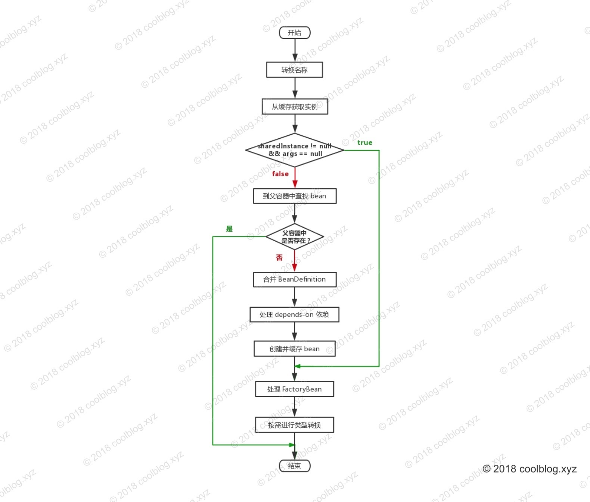
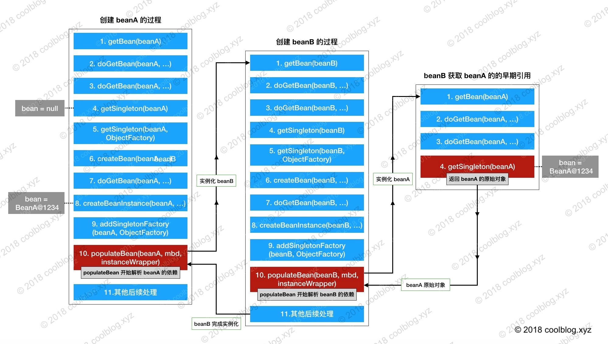

### spring ioc 容器源码分析

#### factoryBean

Spring 中有两种类型的Bean，一种是**普通Bean**，另一种是**工厂Bean 即 FactoryBean**。FactoryBean跟普通Bean不同，其返回的对象不是指定类的一个实例，而是该FactoryBean的getObject方法所返回的对象。创建出来的对象是否属于单例由isSingleton中的返回决定。

**一般情况下，Spring通过反射机制利用<bean>的class属性指定实现类实例化Bean，在某些情况下，实例化Bean过程比较复杂，如果按照传统的方式，则需要在<bean>中提供大量的配置信息。配置方式的灵活性是受限的，这时采用编码的方式可能会得到一个简单的方案。Spring为此提供了一个org.springframework.bean.factory.FactoryBean的工厂类接口，用户可以通过实现该接口定制实例化Bean的逻辑。**

#### depends-on

当一个 bean 直接依赖另一个 bean，可以使用 `<ref/>` 标签进行配置。不过如某个 bean 并不直接依赖于其他 bean，但又需要其他 bean 先实例化好，这个时候就需要使用 depends-on 特性了。depends-on 特性比较简单，就不演示了。仅贴一下配置文件的内容，如下：

这里有两个简单的类，其中 Hello 需要 World 在其之前完成实例化。相关配置如下：

```xml
<bean id="hello" class="xyz.coolblog.depnedson.Hello" depends-on="world"/>
<bean id="world" class="xyz.coolblog.depnedson.World" />
```

#### 1：获取单例 bean

```java
public <T> T getBean(String name, @Nullable Class<T> requiredType, @Nullable Object... args)
  throws BeansException {

 return doGetBean(name, requiredType, args, false);
}
```

总结一下 doGetBean 的执行流程。如下：

1. 转换 beanName
2. 从缓存中获取实例
3. 如果实例不为空，且 args = null。调用 getObjectForBeanInstance 方法，并按 name 规则返回相应的 bean 实例
4. 若上面的条件不成立，则到父容器中查找 beanName 对有的 bean 实例，存在则直接返回
5. 若父容器中不存在，则进行下一步操作 – 合并 BeanDefinition
6. 处理 depends-on 依赖
7. 创建并缓存 bean
8. 调用 getObjectForBeanInstance 方法，并按 name 规则返回相应的 bean 实例
9. 按需转换 bean 类型，并返回转换后的 bean 实例。

以上步骤对应的流程图如下：



##### beanName 转换

```java
protected String transformedBeanName(String name) {
    // 这里调用了两个方法：BeanFactoryUtils.transformedBeanName(name) 和 canonicalName
    return canonicalName(BeanFactoryUtils.transformedBeanName(name));
}
```

在获取 bean 实例之前，Spring 第一件要做的事情是对参数 name 进行转换。转换的目的主要是为了解决两个问题，第一个是处理以字符 & 开头的 name，防止 BeanFactory 无法找到与 name 对应的 bean 实例。第二个是处理别名问题，Spring 不会存储 <别名, bean 实例> 这种映射，仅会存储 <beanName, bean>。所以，同样是为了避免 BeanFactory 找不到 name 对应的 bean 的实例，对于别名也要进行转换。

##### 从 FactoryBean 中获取 bean 实例

getObjectForBeanInstance 及它所调用的方法主要做了如下几件事情：

1. 检测参数 beanInstance 的类型，如果是非 FactoryBean 类型的 bean，直接返回
2. 检测 FactoryBean 实现类是否单例类型，针对单例和非单例类型进行不同处理
3. 对于单例 FactoryBean，先从缓存里获取 FactoryBean 生成的实例
4. 若缓存未命中，则调用 FactoryBean.getObject() 方法生成实例，并放入缓存中
5. 对于非单例的 FactoryBean，每次直接创建新的实例即可，无需缓存
6. 如果 shouldPostProcess = true，不管是单例还是非单例 FactoryBean 生成的实例，都要进行后置处理

#### 2：创建单例 bean 的过程

```java
public T doGetBean(...) {
    // 省略不相关代码
    if (mbd.isSingleton()) {
        sharedInstance = getSingleton(beanName, new ObjectFactory<Object>() {
            @Override
            public Object getObject() throws BeansException {
                try {
                    return createBean(beanName, mbd, args);
                }
                catch (BeansException ex) {
                    destroySingleton(beanName);
                    throw ex;
                }
            }
        });
        bean = getObjectForBeanInstance(sharedInstance, name, beanName, mbd);
    }
    // 省略不相关代码
}
```

createBean 方法被匿名工厂类的 getObject 方法包裹，但这个匿名工厂类对象并未直接调用 getObject 方法。而是将自身作为参数传给了`getSingleton(String, ObjectFactory)`方法.

```java
public Object getSingleton(String beanName, ObjectFactory<?> singletonFactory) {
 Assert.notNull(beanName, "Bean name must not be null");
 synchronized (this.singletonObjects) {
  Object singletonObject = this.singletonObjects.get(beanName);
  if (singletonObject == null) {
   if (this.singletonsCurrentlyInDestruction) {
    throw new BeanCreationNotAllowedException(beanName,
      "Singleton bean creation not allowed while singletons of this factory are in destruction " +
      "(Do not request a bean from a BeanFactory in a destroy method implementation!)");
   }
   if (logger.isDebugEnabled()) {
    logger.debug("Creating shared instance of singleton bean '" + beanName + "'");
   }
   beforeSingletonCreation(beanName);
   boolean newSingleton = false;
   boolean recordSuppressedExceptions = (this.suppressedExceptions == null);
   if (recordSuppressedExceptions) {
    this.suppressedExceptions = new LinkedHashSet<>();
   }
   try {
    singletonObject = singletonFactory.getObject();
    newSingleton = true;
   }
   catch (IllegalStateException ex) {
    // Has the singleton object implicitly appeared in the meantime ->
    // if yes, proceed with it since the exception indicates that state.
    singletonObject = this.singletonObjects.get(beanName);
    if (singletonObject == null) {
     throw ex;
    }
   }
   catch (BeanCreationException ex) {
    if (recordSuppressedExceptions) {
     for (Exception suppressedException : this.suppressedExceptions) {
      ex.addRelatedCause(suppressedException);
     }
    }
    throw ex;
   }
   finally {
    if (recordSuppressedExceptions) {
     this.suppressedExceptions = null;
    }
    afterSingletonCreation(beanName);
   }
   if (newSingleton) {
    addSingleton(beanName, singletonObject);
   }
  }
  return singletonObject;
 }
}
```

简单总结一下。如下：

1. 先从 singletonObjects 集合获取 bean 实例，若不为空，则直接返回
2. 若为空，进入创建 bean 实例阶段。先将 beanName 添加到 singletonsCurrentlyInCreation
3. 通过 getObject 方法调用 createBean 方法创建 bean 实例
4. 将 beanName 从 singletonsCurrentlyInCreation 集合中移除
5. 将 <beanName, singletonObject> 映射缓存到 singletonObjects 集合

##### createBean 方法全貌

1. 解析 bean 类型
2. 处理 lookup-method 和 replace-method 配置
3. 在 bean 初始化前应用后置处理，若后置处理返回的 bean 不为空，则直接返回
4. 若上一步后置处理返回的 bean 为空，则调用 doCreateBean 创建 bean 实例

```java
protected Object doCreateBean(final String beanName, final RootBeanDefinition mbd, final Object[] args)
        throws BeanCreationException {

    /* 
     * BeanWrapper 是一个基础接口，由接口名可看出这个接口的实现类用于包裹 bean 实例。
     * 通过 BeanWrapper 的实现类可以方便的设置/获取 bean 实例的属性
     */
    BeanWrapper instanceWrapper = null;
    if (mbd.isSingleton()) {
        // 从缓存中获取 BeanWrapper，并清理相关记录
        instanceWrapper = this.factoryBeanInstanceCache.remove(beanName);
    }
    if (instanceWrapper == null) {
        /* 
         * 创建 bean 实例，并将实例包裹在 BeanWrapper 实现类对象中返回。createBeanInstance 
         * 中包含三种创建 bean 实例的方式：
         *   1. 通过工厂方法创建 bean 实例
         *   2. 通过构造方法自动注入（autowire by constructor）的方式创建 bean 实例
         *   3. 通过无参构造方法方法创建 bean 实例
         *
         * 若 bean 的配置信息中配置了 lookup-method 和 replace-method，则会使用 CGLIB 
         * 增强 bean 实例。关于这个方法，后面会专门写一篇文章介绍，这里先说这么多。
         */
        instanceWrapper = createBeanInstance(beanName, mbd, args);
    }
```

总结一下 doCreateBean 方法的执行流程吧，如下：

1. 从缓存中获取 BeanWrapper 实现类对象，并清理相关记录
2. 若未命中缓存，则创建 bean 实例，并将实例包裹在 BeanWrapper 实现类对象中返回
3. 应用 MergedBeanDefinitionPostProcessor 后置处理器相关逻辑
4. 根据条件决定是否提前暴露 bean 的早期引用（early reference），用于处理循环依赖问题
5. 调用 populateBean 方法向 bean 实例中填充属性
6. 调用 initializeBean 方法完成余下的初始化工作
7. 注册销毁逻辑

#### 3： 创建原始 bean 对象

```java
protected BeanWrapper createBeanInstance(String beanName, RootBeanDefinition mbd, Object[] args) {
    Class<?> beanClass = resolveBeanClass(mbd, beanName);

    /*
     * 检测类的访问权限。默认情况下，对于非 public 的类，是允许访问的。
     * 若禁止访问，这里会抛出异常
     */
    if (beanClass != null && !Modifier.isPublic(beanClass.getModifiers()) && !mbd.isNonPublicAccessAllowed()) {
        throw new BeanCreationException(mbd.getResourceDescription(), beanName,
                "Bean class isn't public, and non-public access not allowed: " + beanClass.getName());
    }
  
  	Supplier<?> instanceSupplier = mbd.getInstanceSupplier();
		if (instanceSupplier != null) {
			return obtainFromSupplier(instanceSupplier, beanName);
		}

    /*
     * 如果工厂方法不为空，则通过工厂方法构建 bean 对象。这种构建 bean 的方式
     * 就不深入分析了，有兴趣的朋友可以自己去看一下。
     */
    if (mbd.getFactoryMethodName() != null)  {
        // 通过“工厂方法”的方式构建 bean 对象
        return instantiateUsingFactoryMethod(beanName, mbd, args);
    }

    /*
     * 当多次构建同一个 bean 时，可以使用此处的快捷路径，即无需再次推断应该使用哪种方式构造实例，
     * 以提高效率。比如在多次构建同一个 prototype 类型的 bean 时，就可以走此处的捷径。
     * 这里的 resolved 和 mbd.constructorArgumentsResolved 将会在 bean 第一次实例
     * 化的过程中被设置，在后面的源码中会分析到，先继续往下看。
     */
    boolean resolved = false;
    boolean autowireNecessary = false;
    if (args == null) {
        synchronized (mbd.constructorArgumentLock) {
            if (mbd.resolvedConstructorOrFactoryMethod != null) {
                resolved = true;
                autowireNecessary = mbd.constructorArgumentsResolved;
            }
        }
    }
    if (resolved) {
        if (autowireNecessary) {
            // 通过“构造方法自动注入”的方式构造 bean 对象
            return autowireConstructor(beanName, mbd, null, null);
        }
        else {
            // 通过“默认构造方法”的方式构造 bean 对象
            return instantiateBean(beanName, mbd);
        }
    }

    // 由后置处理器决定返回哪些构造方法，这里不深入分析了
    Constructor<?>[] ctors = determineConstructorsFromBeanPostProcessors(beanClass, beanName);
    /*
     * 下面的条件分支条件用于判断使用什么方式构造 bean 实例，有两种方式可选 - 构造方法自动
     * 注入和默认构造方法。判断的条件由4部分综合而成，如下：
     * 
     *    条件1：ctors != null -> 后置处理器返回构造方法数组是否为空
     *    
     *    条件2：mbd.getResolvedAutowireMode() == RootBeanDefinition.AUTOWIRE_CONSTRUCTOR 
     *              -> bean 配置中的 autowire 属性是否为 constructor    
     *    条件3：mbd.hasConstructorArgumentValues() 
     *              -> constructorArgumentValues 是否存在元素，即 bean 配置文件中
     *                 是否配置了 <construct-arg/>
     *    条件4：!ObjectUtils.isEmpty(args) 
     *              -> args 数组是否存在元素，args 是由用户调用 
     *                 getBean(String name, Object... args) 传入的
     * 
     * 上面4个条件，只要有一个为 true，就会通过构造方法自动注入的方式构造 bean 实例
     */
    if (ctors != null ||
            mbd.getResolvedAutowireMode() == RootBeanDefinition.AUTOWIRE_CONSTRUCTOR ||
            mbd.hasConstructorArgumentValues() || !ObjectUtils.isEmpty(args))  {
        // 通过“构造方法自动注入”的方式构造 bean 对象
        return autowireConstructor(beanName, mbd, ctors, args);
    }

    // 通过“默认构造方法”的方式构造 bean 对象
    return instantiateBean(beanName, mbd);
}
```

#### 4:循环依赖的解决办法

```java
@Component
public class Tea {

  @Autowired
  private Water water;
...
}

@Component
public class Water {

  @Autowired
  private Tea tea;
 ...
}
```

IOC 容器在读到上面的配置时，会按照顺序，先去实例化 beanA。然后发现 beanA 依赖于 beanB，接在又去实例化 beanB。实例化 beanB 时，发现 beanB 又依赖于 beanA。如果容器不处理循环依赖的话，容器会无限执行上面的流程，直到内存溢出，程序崩溃。当然，Spring 是不会让这种情况发生的。在容器再次发现 beanB 依赖于 beanA 时，容器会获取 beanA 对象的一个早期的引用（early reference），并把这个早期引用注入到 beanB 中，让 beanB 先完成实例化。beanB 完成实例化，beanA 就可以获取到 beanB 的引用，beanA 随之完成实例化。

| 缓存                  | 用途                                                         |
| :-------------------- | :----------------------------------------------------------- |
| singletonObjects      | 用于存放完全初始化好的 bean，从该缓存中取出的 bean 可以直接使用 |
| earlySingletonObjects | 存放原始的 bean 对象（尚未填充属性），用于解决循环依赖       |
| singletonFactories    | 存放 bean 工厂对象，用于解决循环依赖                         |

##### 回顾获取 bean 的过程


**A. 创建原始 bean 对象**

```java
instanceWrapper = createBeanInstance(beanName, mbd, args);
final Object bean = (instanceWrapper != null ? instanceWrapper.getWrappedInstance() : null);
```

假设 beanA 先被创建，创建后的原始对象为 `BeanA@1234`，上面代码中的 bean 变量指向就是这个对象。

**B:暴露早期引用**

```java
addSingletonFactory(beanName, new ObjectFactory<Object>() {
    @Override
    public Object getObject() throws BeansException {
        return getEarlyBeanReference(beanName, mbd, bean);
    }
});
```

beanA 指向的原始对象创建好后，就开始把指向原始对象的引用通过 ObjectFactory 暴露出去。getEarlyBeanReference 方法的第三个参数 bean 指向的正是 createBeanInstance 方法创建出原始 bean 对象 BeanA@1234。

**C:解析依赖**

```java
populateBean(beanName, mbd, instanceWrapper);
```

populateBean 用于向 beanA 这个原始对象中填充属性，当它检测到 beanA 依赖于 beanB 时，会首先去实例化 beanB。beanB 在此方法处也会解析自己的依赖，当它检测到 beanA 这个依赖，于是调用 BeanFactry.getBean(“beanA”) 这个方法，从容器中获取 beanA。

**D:获取早期引用**

```java
protected Object getSingleton(String beanName, boolean allowEarlyReference) {
    Object singletonObject = this.singletonObjects.get(beanName);
    if (singletonObject == null && isSingletonCurrentlyInCreation(beanName)) {
        synchronized (this.singletonObjects) {
            // ☆ 从缓存中获取早期引用
            singletonObject = this.earlySingletonObjects.get(beanName);
            if (singletonObject == null && allowEarlyReference) {
                ObjectFactory<?> singletonFactory = this.singletonFactories.get(beanName);
                if (singletonFactory != null) {
                    // ☆ 从 SingletonFactory 中获取早期引用
                    singletonObject = singletonFactory.getObject();
                    
                    this.earlySingletonObjects.put(beanName, singletonObject);
                    this.singletonFactories.remove(beanName);
                }
            }
        }
    }
    return (singletonObject != NULL_OBJECT ? singletonObject : null);
}
```

接着上面的步骤讲，populateBean 调用 BeanFactry.getBean(“beanA”) 以获取 beanB 的依赖。getBean(“beanA”) 会先调用 getSingleton(“beanA”)，尝试从缓存中获取 beanA。此时由于 beanA 还没完全实例化好，于是 this.singletonObjects.get(“beanA”) 返回 null。接着 this.earlySingletonObjects.get(“beanA”) 也返回空，因为 beanA 早期引用还没放入到这个缓存中。最后调用 singletonFactory.getObject() 返回 singletonObject，此时 singletonObject != null。singletonObject 指向 BeanA@1234，也就是 createBeanInstance 创建的原始对象。此时 beanB 获取到了这个原始对象的引用，beanB 就能顺利完成实例化。beanB 完成实例化后，beanA 就能获取到 beanB 所指向的实例，beanA 随之也完成了实例化工作。由于 beanB.beanA 和 beanA 指向的是同一个对象 BeanA@1234，所以 beanB 中的 beanA 此时也处于可用状态了。

