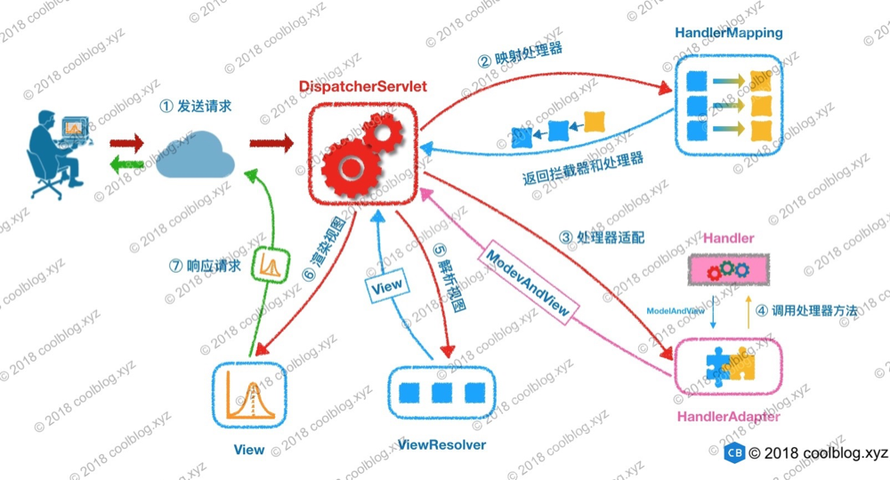

### springmvc 调用过程



从第一步开始，首先，用户的浏览器发出了一个请求，这个请求经过互联网到达了我们的服务器。Servlet 容器首先接待了这个请求，并将该请求委托给 DispatcherServlet 进行处理。接着 DispatcherServlet 将该请求传给了处理器映射组件 HandlerMapping，并获取到适合该请求的拦截器和处理器。在获取到处理器后，DispatcherServlet 还不能直接调用处理器的逻辑，需要进行对处理器进行适配。处理器适配成功后，DispatcherServlet 通过处理器适配器 HandlerAdapter 调用处理器的逻辑，并获取返回值 ModelAndView。之后，DispatcherServlet 需要根据 ModelAndView 解析视图。解析视图的工作由 ViewResolver 完成，若能解析成功，ViewResolver 会返回相应的视图对象 View。在获取到具体的 View 对象后，最后一步要做的事情就是由 View 渲染视图，并将渲染结果返回给用户。

以上就是 Spring MVC 处理请求的全过程，上面的流程进行了一定的简化，比如拦截器的执行时机就没说。不过这并不影响大家对主过程的理解。下来来简单介绍一下图中出现的一些组件：

| 组件              | 说明                                                         |
| :---------------- | :----------------------------------------------------------- |
| DispatcherServlet | Spring MVC 的核心组件，是请求的入口，负责协调各个组件工作    |
| HandlerMapping    | 内部维护了一些 <访问路径, 处理器> 映射，负责为请求找到合适的处理器 |
| HandlerAdapter    | 处理器的适配器。Spring 中的处理器的实现多变，比如用户处理器可以实现 Controller 接口，也可以用 @RequestMapping 注解将方法作为一个处理器等，这就导致 Spring 不止到怎么调用用户的处理器逻辑。所以这里需要一个处理器适配器，由处理器适配器去调用处理器的逻辑 |
| ViewResolver      | 视图解析器的用途不难理解，用于将视图名称解析为视图对象 View。 |
| View              | 视图对象用于将模板渲染成 html 或其他类型的文件。比如 InternalResourceView 可将 jsp 渲染成 html。 |

```properties
org.springframework.web.servlet.HandlerMapping=org.springframework.web.servlet.handler.BeanNameUrlHandlerMapping,\
   org.springframework.web.servlet.mvc.method.annotation.RequestMappingHandlerMapping

org.springframework.web.servlet.HandlerAdapter=org.springframework.web.servlet.mvc.HttpRequestHandlerAdapter,\
   org.springframework.web.servlet.mvc.SimpleControllerHandlerAdapter,\
   org.springframework.web.servlet.mvc.method.annotation.RequestMappingHandlerAdapter
```

DispatchServlet初始化 ini()方法，如果不制定handlerMapping和HandlerAdapter属性时，则默认加载DispatchServlet.properties文件中的配置的属性。其中BeanNameUrlHandlerMapping -> HttpRequestHandlerAdapter和SimpleControllerHandlerAdapter。

示例如下：

```java
@Component("/hi2")
public class Hi2Controller implements Controller {

  @Override
  public ModelAndView handleRequest(HttpServletRequest request, HttpServletResponse response) throws Exception {
    String name = request.getParameter("name");
    System.out.println("parameter[name]: " + name);
    return null;
  }
}

@Component("/hi3")
public class Hi3Controller implements HttpRequestHandler {
    @Override
    public void handleRequest(HttpServletRequest httpServletRequest, HttpServletResponse httpServletResponse) throws ServletException, IOException {
        System.out.println("hello3 ... ");
    }
}
```

这种形式的调用，handlerAdapter会根据是否是对应接口的实例，来强转为接口的类型，来调用。可见adapter方法的实现。

而RequestMappingHandlerAdapter则是根据反射的方式调用具体handler中的方法。